# Решение задания 1

Ниже представлена сводная таблица с обнаруженными багами, их описанием, приоритетом (Priority) и уровнем критичности (Severity), а также обоснованием выставленных приоритетов.  

|№|Баг|Изображение|Описание|Приоритет (Priority)|Критичность (Severity)|Пояснение|
|-|-|-|-|-|-|-|
|1|Не работает вид отображения (карта и вид плитки)|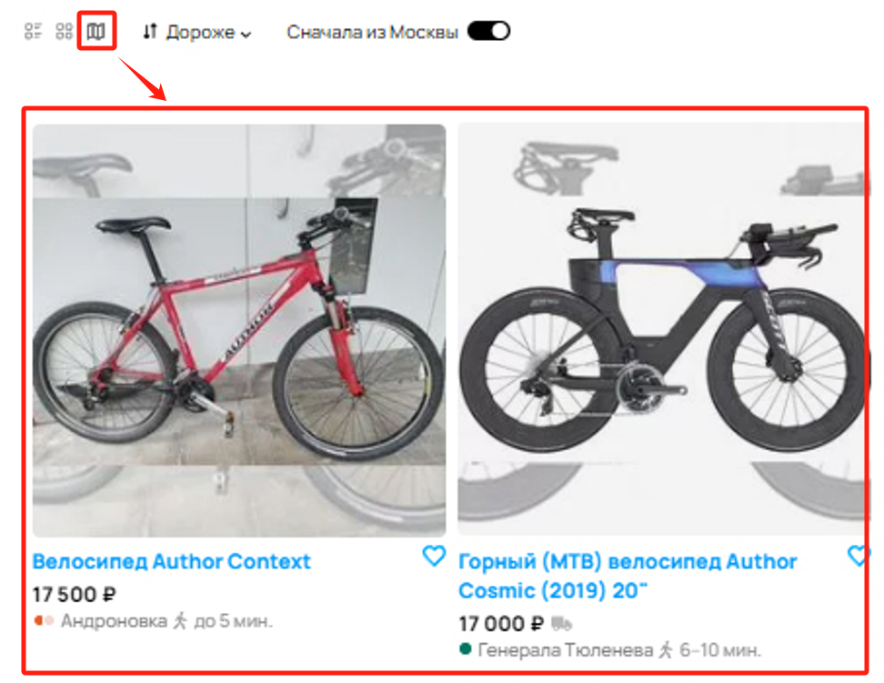|Вместо карты отображается вид плитки - галерея|🟡 Medium|🔴 Major|Функциональный баг, ухудшающий пользовательский опыт, но не критичный для работы сайта.|
|2|Не сортирует по цене|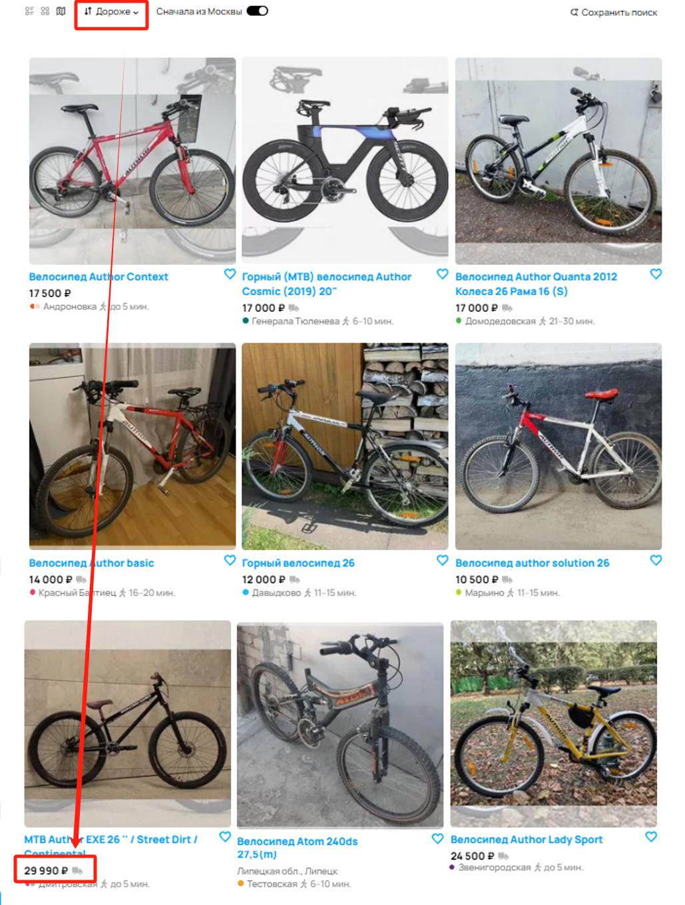|Не работает фильтр сортировки по цене. При выборе "Дороже", наиболее дорогие объявления находятся ниже дешевых.|🔴 High|🔴 Major|Критичный баг для пользователей, мешает поиску объявлений.|
|3|В списке результатов объявление не из Москвы|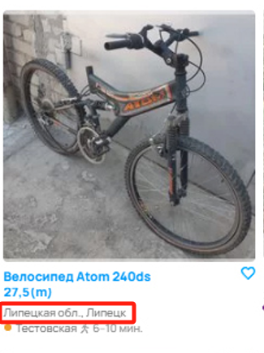|Результаты поиска показывают объявления из другого региона, хотя установлен флажок "Сначала из Москвы"|🔴 High|🔴 Major|Фильтр работает некорректно, что вводит пользователей в заблуждение.|
|4|Вылезло объявление другого бренда|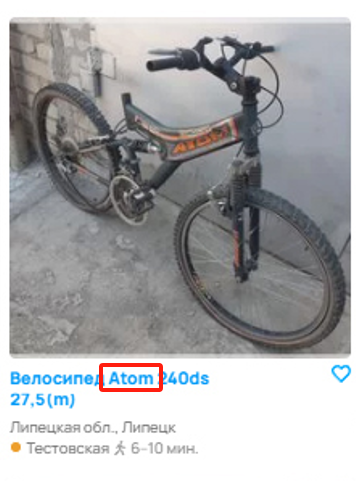|Не все объявления соответствуют бренду "Author"|🟡 Medium|🟡 Minor|Фильтр не выполняет свою задачу, но критичность ниже, чем у геолокации. Вводит пользователей в заблуждение.|
|5|Ошибка в названии станции Ховрино|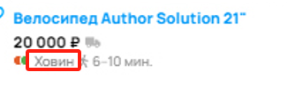|Станция "Ховрино" названа "Ховин"|🟢 Low|🟡 Minor|Орфографическая ошибка, не влияющая на функциональность. Может смутить пользователей.|
|6|Ошибка во времени в пути пешком от метро||Неправильное указание времени в пути пешком от метро. Вместо 11-15 ч. должно быть 11-15 мин.|🟡 Medium|🟢 Trivial|Сильно вводит в заблуждение, но не мешает использованию сайта.|
|7|Неправильный цвет обозначения станции|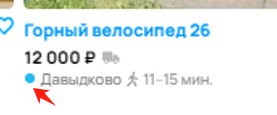|Неверный цвет линии метро|🟢 Low|🟢 Trivial|Ошибочное отображение, но не мешает работе сайта.|
|8|Указано метро в Липецке|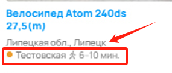|Метро указано в городе, где его нет|🟡 Medium|🟡 Minor|Ошибочная информация, но не критично для поиска.|
|9|Не указана цена|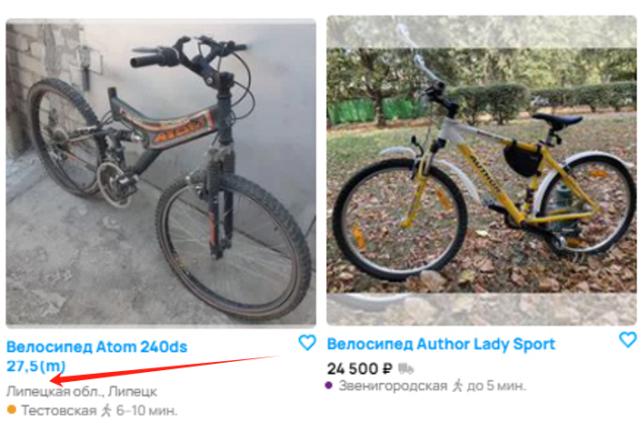|Отсутствует цена в одном объявлении|🔴 High|🔴🔴 Critical|Цена – ключевой параметр объявлений, отсутствие делает объявление бесполезным.|
|10|Не соответствует количество объявлений по фильтру и фактически выданных|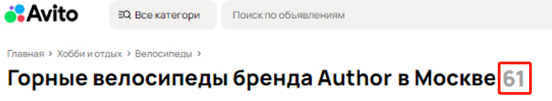|Фильтр показывает, что найдено 9 объявлений, но страница показывает 61 объявлений|🔴 High|🔴 Major|Сильное несоответствие фильтров и выдачи, критично для поиска. Ухудшит пользовательский опыт.|
|11|Слишком много страниц для 61 объявления||Нарушена пагинация. При 12 объявлениях на странице должно быть всего 6 страниц, но отображается 100|🟡 Medium|🟡 Minor|Сбивает пользователей, но не мешает просмотру объявлений.|
|12|Баннер об ошибке|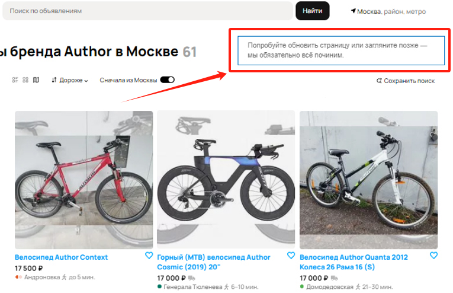|Показывается сообщение о неизвестной ошибке|🔴 High|🔴🔴 Critical|Может указывать на серьезные проблемы на сайте, вызывает недоверие у пользователей.|
|13|Орфографическая ошибка||Отсутствует последняя буква в надписи на кнопке "Все категории"|🟢 Low|🟢 Trivial|Орфографическая ошибка, не влияющая на функциональность. Пользователи скорее всего не заметят.|
|14|Некорректное изображение в объявлении|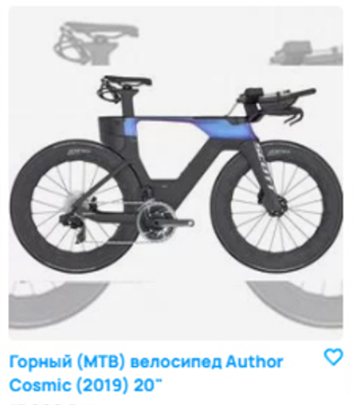|Объявление содержит искаженное изображение велосипеда|🟡 Medium|🟡 Minor|Фото отображается, но из-за искажений пользователи могут неправильно оценить товар. Это снижает доверие к платформе.|
|15|Нерелевантное объявление|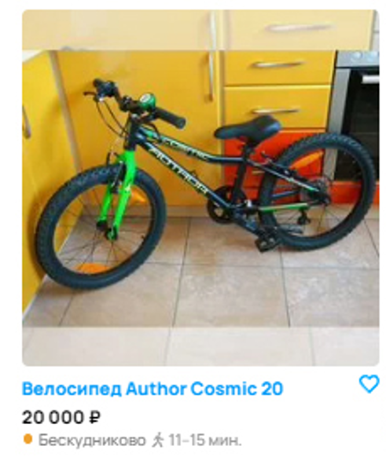|Детский велосипед по запросу "Горные велосипеды бренда Author в Москве"|🔴 High|🔴 Major|Фильтрация работает некорректно, пользователи получают нерелевантные результаты, что мешает поиску нужного товара. При необходимости детского велосипеда, пользователь обязательно указал бы этот пункт.|

### Вывод  
**Критично исправить:**  
- Баги, связанные с неработающими фильтрами (2, 3, 10, 15), т.к. они нарушают поиск.  
- Отсутствие цены (9), т.к. делает объявление бесполезным.  
- Баннер об ошибке (12), т.к. это может указывать на системные проблемы.  

**Важно исправить, но не срочно:**
- Ошибки с неверным отображением информации (6, 8).  
- Неправильное количество страниц (11), так как это сбивает пользователя.  
- Некорректное изображение в объявлении (14).

**Может подождать:**  
- Ошибка в названии станции (5).  
- Цвет линии метро (7).  
- Ошибки отображения, не влияющие на функциональность (1, 4).
- Орфографическая ошибка (13).