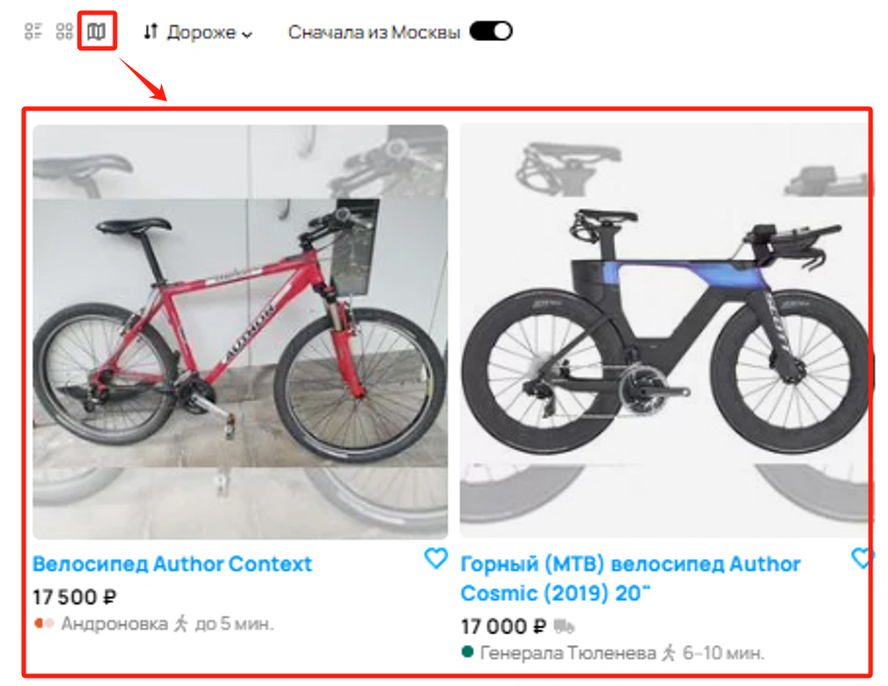
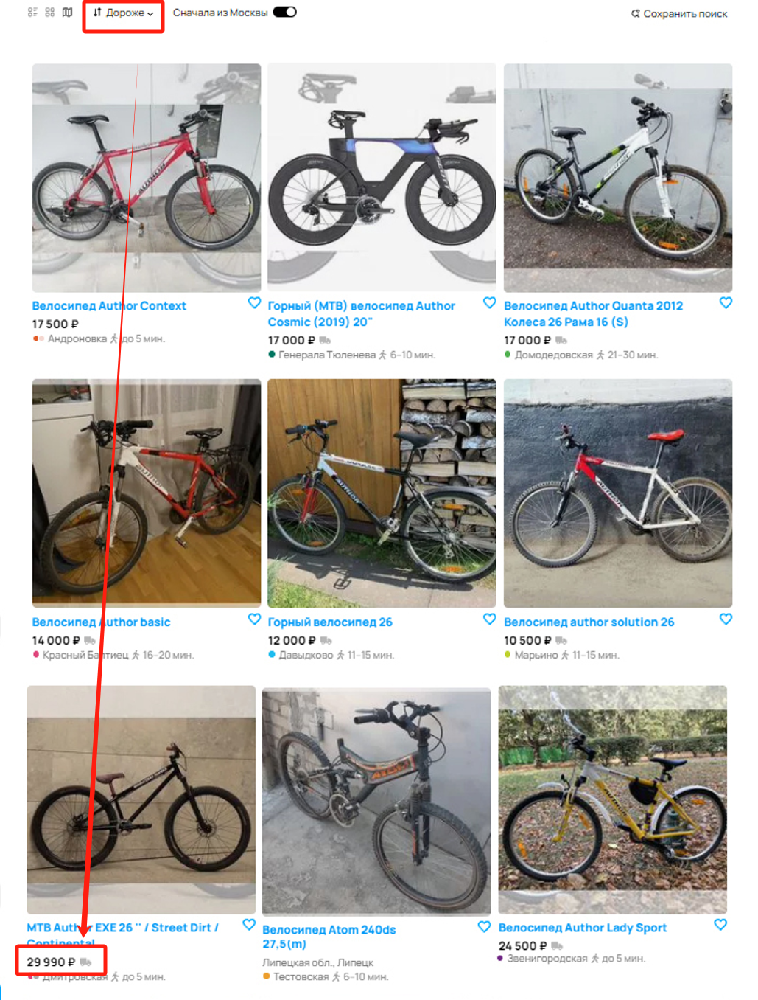
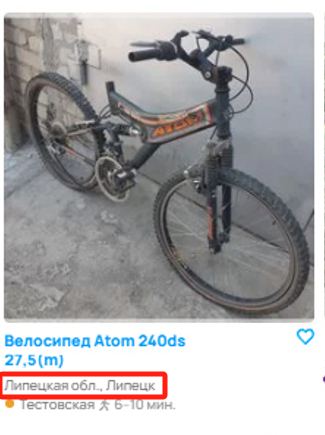
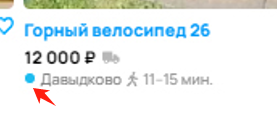

# Таблицы 

|№|Баг|Описание|Приоритет|
|-|-|-|-|
|1|Не работает вид отображения (карта и вид притки)|Вид отображения объявлений должен быть в виде карты, по факту в виде галереи|
|2|не сортирует по цене|Не сортируются объявления по цене|
|3|Попалось объявление не из Москвы|В результатах поиска выдало объявление с гуолокацией в Липецке, хотя был установлен флажок "Сначала из Москвы"|
|4|Вылезло объявление другого бренда |Одно из объявлений не соответствует бренду "Author"|
|5|Ошибка в названии станции Ховрино|Станция "Ховрино" указана как "Ховин"|
|6|Время в пути от станции метро пешком 11-15 ч|Время в пути от метро указано 11-15 часов (должно быть минут)|
|7|Неправильный цвет обозначения станции|Станция "Давыдково" относится к большой кольцевой линии, цвет линии должен быть бирюзовый |
|8|Указано метро в Липецке|В объявлении из Липецка указано метро|
|9|Не указана цена|В одном из объявлений отсутствует цена|
|10|Не соответствует количество объявлений по фильтру и фактически выданных|Согласно разделу с фильтрами должно быть показано 9 объявлений, показано 61 объявление|
|11|Слишком много страниц для 61 объявления|При показе 61 объявления по 12 штук на странице, всего должно быть 6 страниц, а не 100|
|12|Баннер об ошибке|На странице баннер об ошибке, показывающий, что со страницей что-то не так|

Вот анализ багов с учетом приоритета и критичности (priority/severity) по ISTQB:  

|№|Баг|Изображение|Описание|Приоритет (Priority)|Критичность (Severity)|Пояснение|
|-|-|-|-|-|-|-|
|1|Не работает вид отображения (карта и вид плитки)||Вместо карты отображается галерея|Высокий|Средний|Функциональный баг, ухудшающий пользовательский опыт, но не критичный для работы сайта.|
|2|Не сортирует по цене||Фильтр сортировки не работает|Высокий|Высокий|Критичный баг для пользователей, мешает поиску объявлений.|
|3|Попалось объявление не из Москвы||Результаты поиска показывают объявления из другого региона|Высокий|Высокий|Фильтр работает некорректно, что вводит пользователей в заблуждение.|
|4|Вылезло объявление другого бренда||Не все объявления соответствуют бренду "Author"|Средний|Средний|Фильтр не выполняет свою задачу, но критичность ниже, чем у геолокации.|
|5|Ошибка в названии станции Ховрино||Станция "Ховрино" названа "Ховин"|Средний|Низкий|Орфографическая ошибка, не влияющая на функциональность.|
|6|Время в пути от метро пешком 11-15 ч||Неправильное указание времени в пути|Высокий|Средний|Сильно вводит в заблуждение, но не мешает использованию сайта.|
|7|Неправильный цвет обозначения станции||Неверный цвет линии метро|Средний|Низкий|Ошибочное отображение, но не мешает работе сайта.|
|8|Указано метро в Липецке||Метро указано в городе, где его нет|Средний|Средний|Ошибочная информация, но не критично для поиска.|
|9|Не указана цена||Цена отсутствует в одном объявлении|Высокий|Высокий|Цена – ключевой параметр объявлений, отсутствие делает объявление бесполезным.|
|10|Не соответствует количество объявлений по фильтру и фактически выданных||Фильтр показывает 9 объявлений, но их 61|Высокий|Высокий|Сильное несоответствие фильтров и выдачи, критично для поиска.|
|11|Слишком много страниц для 61 объявления||При 12 объявлениях на странице всего 6 страниц, но отображается 100|Средний|Средний|Сбивает пользователя, но не мешает просмотру объявлений.|
|12|Баннер об ошибке||Показывается сообщение о неизвестной ошибке|Критичный|Высокий|Может указывать на серьезные проблемы на сайте, вызывает недоверие у пользователей.|

### Вывод  
Критично исправить:  
- Баги, связанные с неработающими фильтрами (2, 3, 10), т.к. они нарушают поиск.  
- Отсутствие цены (9), т.к. делает объявление бесполезным.  
- Баннер об ошибке (12), т.к. это может указывать на системные проблемы.  

Важно исправить, но не срочно:  
- Ошибки с неверным отображением информации (6, 8, 7).  
- Неправильное количество страниц (11), так как это сбивает пользователя.  

Может подождать:  
- Ошибка в названии станции (5).  
- Цвет линии метро (7).  
- Ошибки отображения, не влияющие на функциональность (1, 4).